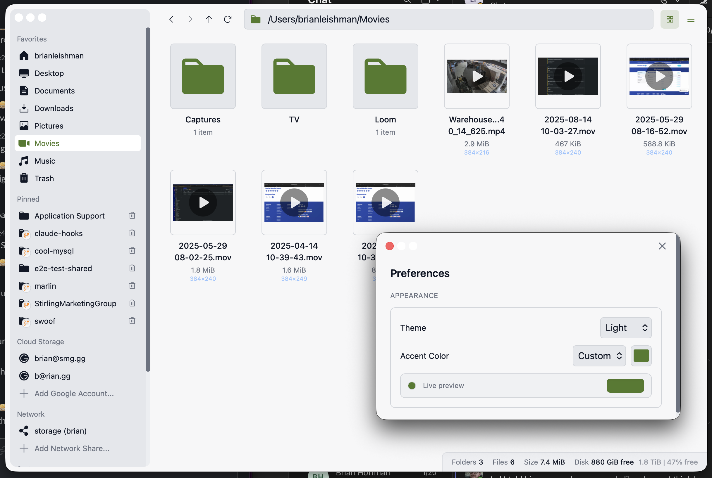
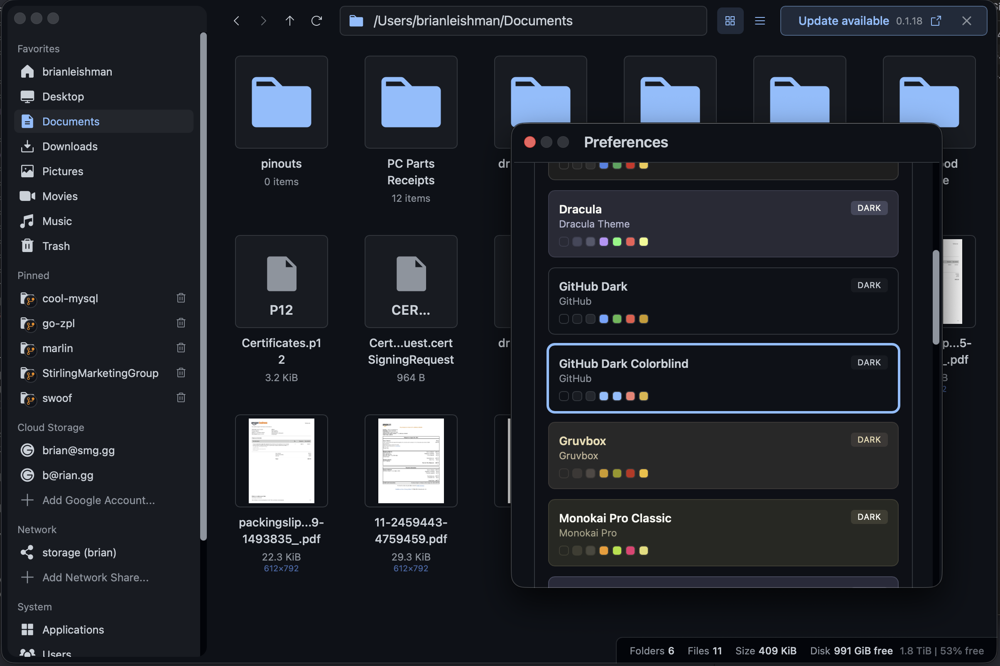

# Marlin

A fast, no-nonsense file browser. Gets out of your way and just does files well.

## Screenshots

<table>
  <tr>
    <td></td>
    <td></td>
  </tr>
  <tr>
    <td></td>
    <td></td>
  </tr>
</table>

## Features

### Core

- Grid view with thumbnails and list view
- Editable path bar with autocomplete
- Type-to-filter: just start typing to filter files instantly
- Marquee selection: click and drag to select multiple files
- Select all with Cmd/Ctrl+A
- Collapsible sidebar with file tree
- **Pinnable favorites**: Drag any folder to the sidebar to pin it for quick access—works with local folders, SMB shares, and Google Drive
- Per-directory view preferences
- Hidden files toggle
- Drag and drop to external apps
- Copy file paths—name or full path (looking at you, Finder!)
- Paste screenshots directly from clipboard as files
- Trash with undo support
- **New Folder** (Cmd/Ctrl+Shift+N): VSCode-style creation with instant rename—type `foo/bar/baz` to create nested directories in one go
- **Rename into subdirs**: Rename any file to `subdir/filename.ext` to create the folder and move it there
- **Browse archives**: Double-click ZIP, RAR, or TAR files to navigate into them like folders
- Calculate folder sizes
- Keyboard navigation
- Dark and light themes
- **Accent color**: Follows your system accent color by default, or choose a custom color in Preferences (Cmd/Ctrl+,)

### Smart Thumbnails

Marlin generates thumbnails for a wide variety of file types—locally and on remote providers:

- **Images**: JPG, PNG, GIF, WebP, BMP, TIFF, TGA, ICO
- **Design files**: PDF, EPS, Adobe Illustrator
- **Vector**: SVG
- **3D models**: STL with shaded rendering
- **Video**: MP4, MOV, MKV, WebM, AVI, and more (frame preview)
- **macOS apps**: .app, .dmg, .pkg icons

Image dimensions shown under thumbnails. Image-heavy folders automatically switch to grid view.

### Google Drive Integration

- **Account Management**: Connect multiple Google accounts from the sidebar
- **Full Navigation**: Browse My Drive, Shared Drives, and Shared with me
- **URL Paste**: Paste any Google Drive folder URL into the path bar to navigate directly
- **Thumbnails**: Full thumbnail support for all file types

### SMB / Network Shares

- Browse Windows shares, NAS devices, and macOS file sharing
- **Blazing fast**: Handles folders with 100k+ files with ease
- **Remote thumbnails**: Generate thumbnails for files on network shares
- Automatic reconnection and credential management

### Archive Browsing

- **Navigate into archives**: Double-click to browse ZIP, RAR, TAR, TAR.GZ, TAR.BZ2, TAR.XZ, and TAR.ZST files like folders
- **Nested archives**: Browse archives within archives
- **Works everywhere**: Local files, SMB shares, and Google Drive
- **Thumbnails inside archives**: Full thumbnail support for images and other files
- **Drag files out**: Drag files from inside an archive to extract them
- **Context menu extraction**: Right-click for "Extract Here" or "Extract to folder/"

### For Developers

- **Git folder badges**: Instantly spot Git repositories in any directory
- **Git status bar**: See branch name, dirty/clean state, ahead/behind counts
- **Click to open remote**: Jump to GitHub/GitLab/etc. directly from the status bar

## Tech

- **Frontend**: React 18, TypeScript, Tailwind CSS, Zustand
- **Backend**: Rust, Tauri 2.0, Tokio

## Themes

Marlin supports custom themes in JSON and iTerm2 `.itermcolors` formats. Theme files placed in the config themes folder load automatically on startup, and you can also import them from Preferences.

Config themes folder:

- macOS: `~/Library/Application Support/com.marlin.filebrowser/themes/`
- Linux: `~/.config/com.marlin.filebrowser/themes/`
- Windows: `%APPDATA%\com.marlin.filebrowser\themes\`

JSON schema:

```json
{
  "id": "my-theme",
  "name": "My Theme",
  "author": "Optional",
  "colorScheme": "dark",
  "colors": {
    "appDark": "#1e1e1e",
    "appDarker": "#121212",
    "appGray": "#262626",
    "appLight": "#2e2e2e",
    "text": "#e6e6e7",
    "muted": "#a1a1aa",
    "border": "#3a3a3a",
    "accent": "#3584e4",
    "green": "#23a55a",
    "red": "#e01b24",
    "yellow": "#f6c84c"
  }
}
```

## Install

Download from [Releases](https://github.com/StirlingMarketingGroup/marlin/releases):

- **macOS**: `.dmg`
- **Windows**: `.msi` (coming soon)
- **Linux**: `.AppImage` or `.deb`

Or use the install script:

```bash
curl -fsSL https://raw.githubusercontent.com/StirlingMarketingGroup/marlin/main/scripts/install.sh | bash
```

## Development

### Requirements

- Node.js 18+
- Rust 1.77+
- Linux only: GTK/WebKit toolchain

```bash
# Linux (Debian/Ubuntu)
sudo apt update
sudo apt install build-essential pkg-config libssl-dev \
  libgtk-3-dev libayatana-appindicator3-dev librsvg2-dev
sudo apt install libwebkit2gtk-4.1-dev || sudo apt install libwebkit2gtk-4.0-dev
```

### Setup

```bash
git clone https://github.com/StirlingMarketingGroup/marlin.git
cd marlin
npm install
npm run tauri dev
```

### Build

```bash
npm run tauri build
```

### SMB Support (Optional)

SMB/network share support requires libsmbclient and is built as a separate sidecar binary to ensure the main app always starts even if samba isn't installed.

**Install samba:**

```bash
# macOS
brew install samba

# Linux (Debian/Ubuntu)
sudo apt install libsmbclient-dev smbclient
```

**Build the SMB sidecar (development):**

```bash
npm run build:smb-sidecar
```

**Build the SMB sidecar (release):**

```bash
npm run build:smb-sidecar-release
```

After building the sidecar, run `npm run tauri dev` or `npm run tauri build` as usual. The main app will automatically use the sidecar for SMB operations if available.

### Project Structure

```text
marlin/
├── src/                # React frontend
│   ├── components/
│   ├── hooks/
│   ├── store/
│   └── types/
├── src-tauri/          # Rust backend
│   └── src/
└── public/
```

## Contributing

1. Fork the repo
2. Create a branch: `git checkout -b feature/thing`
3. Make changes and commit
4. Push and open a PR

Please run `npm run build` and `cargo build` before submitting to catch errors.

## License

MIT
